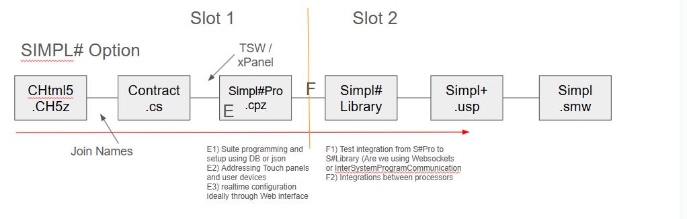

# Crestron SIMPL# Multi-Processor Proof of Concept 



[](https://shields.io/)
[](https://www.crestron.com/Products/Control-Hardware-Software/Hardware/Control-Systems)

---

## Overview

This repository demonstrates a **proof of concept** showing how **multiple Crestron 4-Series SIMPL# Pro programs can connect and communicate with each other**.  
It introduces a flexible configuration approach using JSON or a database, making it easy to manage device names, numbers of lights, floors, rooms, and areas.

---

## Key Features

- **Multiple Processor Connectivity:**  
  Seamlessly connect and synchronize logic between different 4-Series processors using standard communication patterns and shared contracts.

- **Centralized Configuration:**  
  Store all system details (e.g., room names, number of lights, floors) in a JSON file or database—no code changes needed for most updates!

- **Modular Development:**  
  Leverage SIMPL# Libraries (NuGet/Nugget packages) for shared logic, ensuring consistency and easy reuse across programs.

---

## System Architecture

See the diagram above for a visual of the system structure:

- **Slot 1:**  
  SIMPL# Pro programs and UI/contract files manage local logic and handle communication with UIs (TSW/xPanel) or other processors.
- **Slot 2:**  
  Shared SIMPL# Libraries and classic SIMPL+/SIMPL code provide device integration and advanced automation logic.
- **Configuration Layer:**  
  JSON/database files store all system setup data (lights, areas, etc.).

---

## Proof of Concept Scope

> **Note:** This project is for demonstration purposes only.

- Demonstrates multi-processor connectivity with shared configuration
- Uses modern C# patterns and SIMPL# Libraries/Nuggets
- **Not for production use** – experimental code and architecture, minimal error handling

---

## Example Configuration (JSON)

```json
{
  "floors": [
    {
      "name": "First Floor",
      "areas": [
        {
          "name": "Lobby",
          "lights": 10
        },
        {
          "name": "Conference Room",
          "lights": 8
        }
      ]
    }
  ]
}
